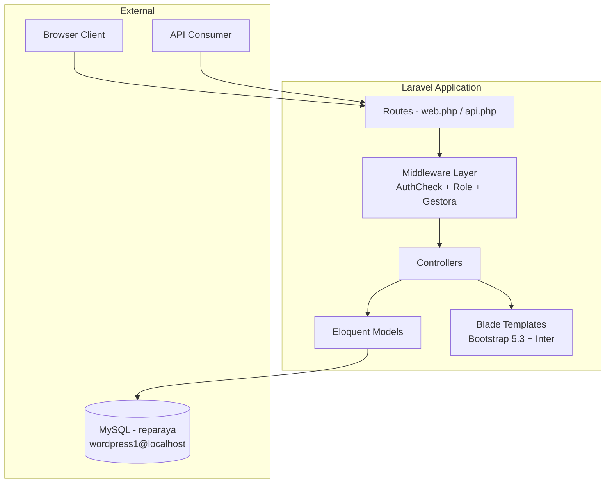
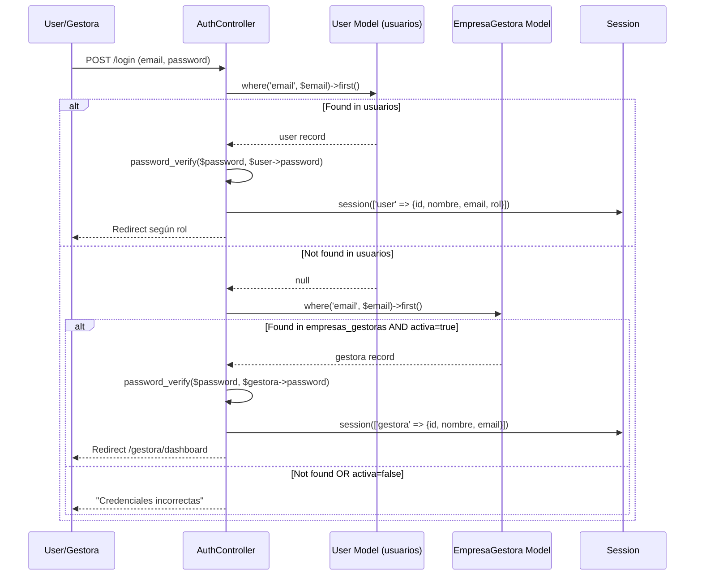
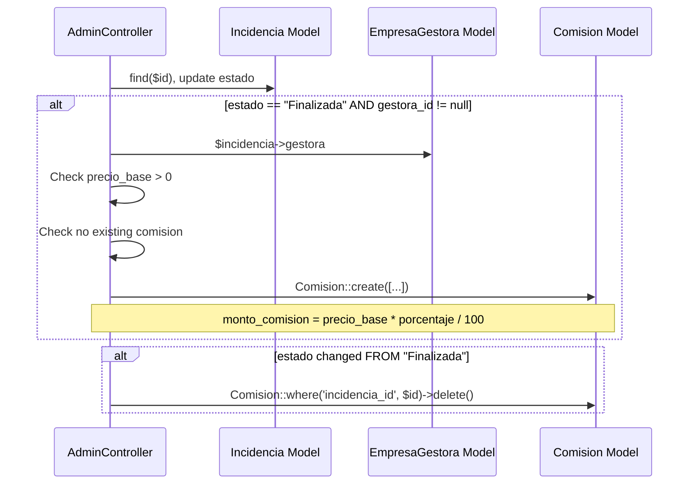

# Design Document: Laravel Migration B2B

## Overview

Proyecto Laravel 10 con arquitectura MVC estándar que migra la aplicación ReparaYa desde un framework PHP custom a Laravel. Desplegado bajo subdirectorio `/producto3` en servidor Apache compartido (UOC). Autenticación basada en sesiones PHP con middleware custom para roles y gestoras. Módulo B2B con tabla separada para empresas gestoras y cálculo automático de comisiones. API REST stateless para datos agregados por zona.

La migración preserva toda la funcionalidad existente (autenticación, gestión de incidencias, asignación de técnicos, gestión de especialidades) y añade:

1. **Módulo Gestora**: Registro, autenticación y panel para Empresas Gestoras (Administradores de Fincas)
2. **Motor de Comisiones**: Cálculo automático de comisiones cuando servicios vinculados a una Gestora se finalizan
3. **API REST**: Endpoint público que devuelve datos agregados de servicios finalizados por zona
4. **Despliegue**: Configuración para servidor UOC con prefijo URL `/producto3`

### Tech Stack

- **Framework:** Laravel 10 (PHP 8.2)
- **BD:** MySQL 8.0 (servidor UOC: wordpress1@localhost/reparaya)
- **Frontend:** Blade templates + Bootstrap 5.3 CDN + Google Fonts Inter + CSS custom
- **Servidor:** Apache con mod_rewrite, acceso via ~/public_html/producto3/
- **Auth:** Sesiones PHP con session('user') y session('gestora') + middleware custom

## Architecture

### High-Level Architecture



### Authentication Flow

Login unificado en `AuthController@login`:



### Commission Calculation Flow

Trigger directo en `AdminController@updateIncidencia` (sin service classes separadas):



## Components and Interfaces

### Controllers

| Controller | Responsibility | Key Methods |
|---|---|---|
| `AuthController` | Login unificado (usuarios + gestoras), registro, logout | `showLogin`, `login`, `showRegister`, `register`, `logout` |
| `AdminController` | Dashboard admin, gestión incidencias, gestión gestoras, liquidación, **cálculo de comisiones** | `dashboard`, `incidencias`, `asignarTecnico`, `crearIncidencia`, `storeIncidencia`, `editIncidencia`, `updateIncidencia`, `cancelarIncidencia`, `calendario`, `gestoras`, `crearGestora`, `storeGestora`, `editGestora`, `updateGestora`, `comisionesGestora`, `liquidacionMensual` |
| `ClienteController` | Dashboard cliente, mis avisos, crear/cancelar incidencia | `dashboard`, `misAvisos`, `create`, `store`, `cancel` |
| `TecnicoController` | CRUD técnicos (admin) y agenda (técnico) | `index`, `store`, `update`, `delete`, `agenda` |
| `EspecialidadController` | CRUD especialidades | `index`, `store`, `update`, `delete` |
| `UserController` | Perfil de usuario | `perfil`, `updatePerfil` |
| `GestoraController` | Panel gestora: dashboard, crear aviso, liquidaciones | `dashboard`, `crearAviso`, `storeAviso`, `liquidaciones` |
| `ApiController` | REST API endpoint | `serviciosPorZona` |

**Nota de diseño:** La lógica de comisiones se implementa directamente en `AdminController@updateIncidencia` en lugar de usar Service classes separadas. Esto simplifica la arquitectura para el alcance del proyecto.

### Middleware

| Middleware | Alias | Purpose | Logic |
|---|---|---|---|
| `AuthCheck` | `authcheck` | Protege rutas que requieren autenticación | Verifica `session('user')` OR `session('gestora')` existe, sino redirect `/login` |
| `RoleMiddleware` | `role` | Verifica rol del usuario | Recibe roles como params, verifica `session('user.rol')` está en la lista |
| `GestoraMiddleware` | `gestora` | Verifica sesión de gestora | Verifica `session('gestora')` existe, sino redirect `/login` |

Registro en `Kernel.php` `$middlewareAliases`:
```php
'authcheck' => \App\Http\Middleware\AuthCheck::class,
'role' => \App\Http\Middleware\RoleMiddleware::class,
'gestora' => \App\Http\Middleware\GestoraMiddleware::class,
```

### Routes Structure

Todas las rutas bajo prefix `/producto3` (configurado en RouteServiceProvider).

#### routes/web.php
```php
// Públicas
Route::get('/login', [AuthController::class, 'showLogin']);
Route::post('/login', [AuthController::class, 'login']);
Route::get('/register', [AuthController::class, 'showRegister']);
Route::post('/register', [AuthController::class, 'register']);
Route::get('/logout', [AuthController::class, 'logout']);

// Cliente (middleware: authcheck + role:particular)
Route::middleware(['authcheck', 'role:particular'])->prefix('cliente')->group(function () {
    Route::get('/dashboard', [ClienteController::class, 'dashboard']);
    Route::get('/mis-avisos', [ClienteController::class, 'misAvisos']);
    Route::get('/nueva-incidencia', [ClienteController::class, 'create']);
    Route::post('/nueva-incidencia', [ClienteController::class, 'store']);
    Route::post('/cancelar-incidencia', [ClienteController::class, 'cancel']);
});

// Admin (middleware: authcheck + role:admin)
Route::middleware(['authcheck', 'role:admin'])->prefix('admin')->group(function () {
    Route::get('/dashboard', [AdminController::class, 'dashboard']);
    Route::get('/incidencias', [AdminController::class, 'incidencias']);
    Route::get('/crear-incidencia', [AdminController::class, 'crearIncidencia']);
    Route::post('/crear-incidencia', [AdminController::class, 'storeIncidencia']);
    Route::get('/editar-incidencia/{id}', [AdminController::class, 'editIncidencia']);
    Route::post('/actualizar-incidencia/{id}', [AdminController::class, 'updateIncidencia']);
    Route::post('/asignar-tecnico', [AdminController::class, 'asignarTecnico']);
    Route::post('/cancelar-incidencia', [AdminController::class, 'cancelarIncidencia']);
    Route::get('/calendario', [AdminController::class, 'calendario']);
    Route::get('/gestoras', [AdminController::class, 'gestoras']);
    Route::get('/gestoras/crear', [AdminController::class, 'crearGestora']);
    Route::post('/gestoras/crear', [AdminController::class, 'storeGestora']);
    Route::get('/gestoras/editar/{id}', [AdminController::class, 'editGestora']);
    Route::post('/gestoras/actualizar/{id}', [AdminController::class, 'updateGestora']);
    Route::get('/gestoras/{id}/comisiones', [AdminController::class, 'comisionesGestora']);
    Route::get('/liquidacion-mensual', [AdminController::class, 'liquidacionMensual']);
});

// Técnicos CRUD (middleware: authcheck + role:admin)
Route::middleware(['authcheck', 'role:admin'])->group(function () {
    Route::get('/tecnicos', [TecnicoController::class, 'index']);
    Route::post('/tecnicos/guardar', [TecnicoController::class, 'store']);
    Route::post('/tecnicos/actualizar/{id}', [TecnicoController::class, 'update']);
    Route::post('/tecnicos/eliminar/{id}', [TecnicoController::class, 'delete']);
});

// Especialidades CRUD (middleware: authcheck + role:admin)
Route::middleware(['authcheck', 'role:admin'])->group(function () {
    Route::get('/especialidades', [EspecialidadController::class, 'index']);
    Route::post('/especialidades/guardar', [EspecialidadController::class, 'store']);
    Route::post('/especialidades/actualizar/{id}', [EspecialidadController::class, 'update']);
    Route::post('/especialidades/eliminar/{id}', [EspecialidadController::class, 'delete']);
});

// Técnico agenda (middleware: authcheck + role:tecnico)
Route::middleware(['authcheck', 'role:tecnico'])->group(function () {
    Route::get('/tecnico/agenda', [TecnicoController::class, 'agenda']);
});

// Perfil (middleware: authcheck)
Route::middleware(['authcheck'])->group(function () {
    Route::get('/perfil', [UserController::class, 'perfil']);
    Route::post('/perfil', [UserController::class, 'updatePerfil']);
});

// Gestora (middleware: gestora)
Route::middleware(['gestora'])->prefix('gestora')->group(function () {
    Route::get('/dashboard', [GestoraController::class, 'dashboard']);
    Route::get('/crear-aviso', [GestoraController::class, 'crearAviso']);
    Route::post('/crear-aviso', [GestoraController::class, 'storeAviso']);
    Route::get('/liquidaciones', [GestoraController::class, 'liquidaciones']);
});
```

#### routes/api.php
```php
// URL final: /producto3/api/servicios/zonas
Route::get('/servicios/zonas', [ApiController::class, 'serviciosPorZona']);
```

### Commission Logic (in AdminController)

```php
// En AdminController@updateIncidencia
public function updateIncidencia(Request $request, $id)
{
    $incidencia = Incidencia::findOrFail($id);
    $estadoAnterior = $incidencia->estado_id;
    
    // ... update incidencia fields ...
    
    $estadoFinalizada = Estado::where('nombre_estado', 'Finalizada')->first()->id;
    
    // Crear comisión si pasa a Finalizada con gestora
    if ($incidencia->estado_id == $estadoFinalizada && $incidencia->gestora_id) {
        $gestora = $incidencia->gestora;
        if ($incidencia->precio_base > 0 && !Comision::where('incidencia_id', $id)->exists()) {
            Comision::create([
                'gestora_id' => $incidencia->gestora_id,
                'incidencia_id' => $incidencia->id,
                'monto_base' => $incidencia->precio_base,
                'porcentaje_aplicado' => $gestora->porcentaje_comision,
                'monto_comision' => round($incidencia->precio_base * ($gestora->porcentaje_comision / 100), 2),
                'mes' => now()->startOfMonth()->toDateString(),
                'pagada' => false,
            ]);
        }
    }
    
    // Revocar comisión si sale de Finalizada
    if ($estadoAnterior == $estadoFinalizada && $incidencia->estado_id != $estadoFinalizada) {
        Comision::where('incidencia_id', $id)->delete();
    }
    
    return redirect()->route('admin.incidencias')->with('success', 'Incidencia actualizada');
}
```

### Price Map (inline constant)

```php
// En AdminController y ClienteController/GestoraController
private const PRECIOS = [
    'Fontanería' => 80.00,
    'Electricidad' => 65.00,
    'Aire acondicionado' => 120.00,
    'Bricolaje' => 45.00,
    'Cerrajería' => 90.00,
    'Pintura' => 70.00,
];
```

## Data Models

### Entity Relationship Diagram

```mermaid
erDiagram
    usuarios {
        int id PK
        string nombre
        string email UK
        string password
        enum rol "admin|tecnico|particular"
        string telefono
        timestamps created_at_updated_at
    }

    especialidades {
        int id PK
        string nombre_especialidad
        timestamps created_at_updated_at
    }

    estados {
        int id PK
        string nombre_estado
        timestamps created_at_updated_at
    }

    zonas {
        int id PK
        string nombre_zona
        timestamps created_at_updated_at
    }

    tecnicos {
        int id PK
        int usuario_id FK UK
        string nombre_completo
        int especialidad_id FK
        boolean disponible
        timestamps created_at_updated_at
    }

    incidencias {
        int id PK
        string localizador UK
        int cliente_id FK
        int tecnico_id FK
        int especialidad_id FK
        int estado_id FK
        int zona_id FK
        int gestora_id FK
        text descripcion
        string direccion
        datetime fecha_servicio
        enum tipo_urgencia "estandar|urgente"
        decimal precio_base
        string nombre_residente
        timestamps created_at_updated_at
    }

    empresas_gestoras {
        int id PK
        string nombre
        string CIF UK
        string direccion
        string telefono
        string email UK
        string password
        decimal porcentaje_comision
        boolean activa
        timestamps created_at_updated_at
    }

    comisiones {
        int id PK
        int gestora_id FK
        int incidencia_id FK
        decimal monto_base
        decimal porcentaje_aplicado
        decimal monto_comision
        date mes
        boolean pagada
        timestamps created_at_updated_at
    }

    usuarios ||--o{ incidencias : "creates (cliente_id)"
    tecnicos ||--o{ incidencias : "assigned (tecnico_id)"
    especialidades ||--o{ incidencias : "categorizes"
    estados ||--o{ incidencias : "status"
    zonas ||--o{ incidencias : "located in"
    empresas_gestoras ||--o{ incidencias : "creates (gestora_id)"
    empresas_gestoras ||--o{ comisiones : "earns"
    incidencias ||--o| comisiones : "generates"
    usuarios ||--o| tecnicos : "linked (usuario_id)"
    especialidades ||--o{ tecnicos : "specializes"
```

### Eloquent Models

#### User Model
```php
class User extends Model
{
    protected $table = 'usuarios';
    protected $fillable = ['nombre', 'email', 'password', 'rol', 'telefono'];
    protected $hidden = ['password'];

    public function incidencias(): HasMany { return $this->hasMany(Incidencia::class, 'cliente_id'); }
    public function tecnico(): HasOne { return $this->hasOne(Tecnico::class, 'usuario_id'); }
}
```

#### Incidencia Model
```php
class Incidencia extends Model
{
    protected $table = 'incidencias';
    protected $fillable = [
        'localizador', 'cliente_id', 'tecnico_id', 'especialidad_id',
        'estado_id', 'zona_id', 'gestora_id', 'descripcion', 'direccion',
        'fecha_servicio', 'tipo_urgencia', 'precio_base', 'nombre_residente'
    ];

    public function cliente(): BelongsTo { return $this->belongsTo(User::class, 'cliente_id'); }
    public function tecnico(): BelongsTo { return $this->belongsTo(Tecnico::class, 'tecnico_id'); }
    public function especialidad(): BelongsTo { return $this->belongsTo(Especialidad::class); }
    public function estado(): BelongsTo { return $this->belongsTo(Estado::class); }
    public function zona(): BelongsTo { return $this->belongsTo(Zona::class); }
    public function gestora(): BelongsTo { return $this->belongsTo(EmpresaGestora::class, 'gestora_id'); }
    public function comision(): HasOne { return $this->hasOne(Comision::class); }
}
```

#### EmpresaGestora Model
```php
class EmpresaGestora extends Model
{
    protected $table = 'empresas_gestoras';
    protected $fillable = [
        'nombre', 'CIF', 'direccion', 'telefono', 'email',
        'password', 'porcentaje_comision', 'activa'
    ];
    protected $hidden = ['password'];
    protected $casts = ['activa' => 'boolean', 'porcentaje_comision' => 'decimal:2'];

    public function incidencias(): HasMany { return $this->hasMany(Incidencia::class, 'gestora_id'); }
    public function comisiones(): HasMany { return $this->hasMany(Comision::class, 'gestora_id'); }
}
```

#### Comision Model
```php
class Comision extends Model
{
    protected $table = 'comisiones';
    protected $fillable = [
        'gestora_id', 'incidencia_id', 'monto_base',
        'porcentaje_aplicado', 'monto_comision', 'mes', 'pagada'
    ];
    protected $casts = [
        'monto_base' => 'decimal:2',
        'porcentaje_aplicado' => 'decimal:2',
        'monto_comision' => 'decimal:2',
        'mes' => 'date',
        'pagada' => 'boolean'
    ];

    public function gestora(): BelongsTo { return $this->belongsTo(EmpresaGestora::class, 'gestora_id'); }
    public function incidencia(): BelongsTo { return $this->belongsTo(Incidencia::class); }
}
```

#### Supporting Models
```php
class Tecnico extends Model {
    protected $table = 'tecnicos';
    protected $fillable = ['usuario_id', 'nombre_completo', 'especialidad_id', 'disponible'];

    public function usuario(): BelongsTo { return $this->belongsTo(User::class, 'usuario_id'); }
    public function especialidad(): BelongsTo { return $this->belongsTo(Especialidad::class); }
    public function incidencias(): HasMany { return $this->hasMany(Incidencia::class, 'tecnico_id'); }
}

class Especialidad extends Model {
    protected $table = 'especialidades';
    protected $fillable = ['nombre_especialidad'];
}

class Estado extends Model {
    protected $table = 'estados';
    protected $fillable = ['nombre_estado'];
}

class Zona extends Model {
    protected $table = 'zonas';
    protected $fillable = ['nombre_zona'];
}
```

### Migration Order

1. `2024_01_01_000001_create_usuarios_table`
2. `2024_01_01_000002_create_especialidades_table`
3. `2024_01_01_000003_create_estados_table`
4. `2024_01_01_000004_create_zonas_table`
5. `2024_01_01_000005_create_tecnicos_table`
6. `2024_01_01_000006_create_empresas_gestoras_table`
7. `2024_01_01_000007_create_incidencias_table`
8. `2024_01_01_000008_add_b2b_columns_to_incidencias_table`
9. `2024_01_01_000009_create_comisiones_table`

### Seeders

```php
// DatabaseSeeder.php - orden de ejecución
$this->call([
    EstadoSeeder::class,        // Pendiente, Asignada, Finalizada, Cancelada
    EspecialidadSeeder::class,  // Fontanería, Electricidad, Aire acondicionado, Bricolaje, Cerrajería, Pintura
    ZonaSeeder::class,          // Centro, Norte, Sur, Este, Oeste, Ensanche
    UserSeeder::class,          // Admin: root@uoc.edu/123456
    EmpresaGestoraSeeder::class, // Fincas López (10%), Gestiones Martínez (5%)
]);
```

## Correctness Properties

*A property is a characteristic or behavior that should hold true across all valid executions of a system — essentially, a formal statement about what the system should do. Properties serve as the bridge between human-readable specifications and machine-verifiable correctness guarantees.*

### Property 1: 48-hour rule enforcement for standard services

*For any* fecha_servicio that is less than 48 hours (172800 seconds) from the current time, and tipo_urgencia is "estandar", the system SHALL reject the incidencia creation for clients and gestoras, leaving the incidencia count unchanged.

**Validates: Requirements 2.7, 4.3**

### Property 2: Admin bypasses 48-hour restriction

*For any* fecha_servicio (past or future) and any tipo_urgencia value, when an admin creates an incidencia, the system SHALL allow the creation without applying the 48-hour restriction.

**Validates: Requirements 2.8**

### Property 3: Localizador format and uniqueness

*For any* generated localizador, it SHALL match the pattern `R[A-Z0-9]{6}` (letter R followed by exactly 6 uppercase alphanumeric characters), and no two incidencias in the system SHALL share the same localizador value.

**Validates: Requirements 2.10, 4.5**

### Property 4: Precio base assignment by especialidad

*For any* newly created incidencia with a valid especialidad_id, the precio_base field SHALL be automatically assigned the value from the price map corresponding to that especialidad (Fontanería=80, Electricidad=65, Aire acondicionado=120, Bricolaje=45, Cerrajería=90, Pintura=70).

**Validates: Requirements 2.14, 4.7**

### Property 5: Commission creation on finalization with gestora

*For any* incidencia with a non-null gestora_id and precio_base > 0, when the estado transitions to "Finalizada", the system SHALL create exactly one comision record with monto_comision = round(precio_base * porcentaje_comision / 100, 2).

**Validates: Requirements 5.1, 5.2**

### Property 6: No commission without gestora or with invalid precio

*For any* incidencia where gestora_id is NULL, or precio_base is NULL, zero, or negative, transitioning to "Finalizada" SHALL NOT create a comision record.

**Validates: Requirements 5.4, 5.6, 5.8**

### Property 7: Commission idempotency

*For any* incidencia that already has an associated comision record, re-transitioning to "Finalizada" SHALL NOT create a duplicate comision record.

**Validates: Requirements 5.5**

### Property 8: Commission revocation on state change

*For any* incidencia with an existing comision record, when the estado transitions away from "Finalizada" to any other state, the system SHALL delete the associated comision record.

**Validates: Requirements 5.7**

### Property 9: API zone percentages sum to 100

*For any* non-empty set of finalized incidencias distributed across zones, the sum of all `porcentaje` values returned by GET /api/servicios/zonas SHALL be between 99.99 and 100.01 inclusive.

**Validates: Requirements 8.3**

### Property 10: API only counts finalized incidencias

*For any* set of incidencias with mixed estados, the total_servicios per zone returned by the API SHALL equal the count of incidencias with estado "Finalizada" and non-null zona_id in that zone only.

**Validates: Requirements 8.6**

### Property 11: Middleware role enforcement

*For any* protected route and any session state, if `session('user')` and `session('gestora')` are both absent, the AuthCheck middleware SHALL redirect to `/login`. If `session('user.rol')` does not match the required role for a route, the RoleMiddleware SHALL deny access.

**Validates: Requirements 2.6, 3.7, 3.8**

## Error Handling

| Scenario | Handler | Response |
|---|---|---|
| Validation failure (forms) | Controller with `$request->validate()` | Redirect back with errors + old input |
| 48h rule violation | Controller logic | Redirect back with flash error message |
| Duplicate CIF/email (gestora) | Validation unique rule | Redirect back with specific error |
| Invalid credentials (login) | AuthController | Redirect to login with generic error |
| Inactive gestora login | AuthController | Redirect to login with "cuenta inactiva" error |
| Route not found | Laravel 404 handler | HTTP 404 response |
| Method not allowed (API) | Route definition | HTTP 405 with JSON error |
| Unauthorized access | Middleware redirect | Redirect to login or appropriate dashboard |
| Database constraint violation | Try/catch in controller | Redirect back with error message |

## Testing Strategy

### Unit Tests (PHPUnit)

- **AuthController**: Login flow for usuarios and gestoras, inactive gestora rejection, invalid credentials
- **AdminController**: Commission creation/revocation logic, incidencia state transitions
- **ClienteController**: 48h rule validation, incidencia creation with correct precio_base
- **GestoraController**: Aviso creation with gestora_id linkage
- **Middleware**: AuthCheck, RoleMiddleware, GestoraMiddleware redirect behavior
- **API**: Response structure, filtering, percentage calculation

### Property-Based Tests (PHPUnit with data providers)

Property-based testing applies to the business logic in this project, particularly:
- Commission calculation (pure arithmetic)
- 48-hour date validation (date comparison logic)
- Localizador generation (format validation)
- Precio base assignment (lookup logic)
- API percentage calculation (mathematical invariant)

**Library:** PHPUnit with `@dataProvider` methods generating randomized inputs (minimum 100 iterations per property).

**Tag format:** `Feature: laravel-migration-b2b, Property {number}: {property_text}`

### Integration Tests

- Full login flow (session creation and redirect)
- Incidencia creation end-to-end (form → DB → redirect)
- Commission lifecycle (create incidencia → finalize → verify comision → change state → verify deletion)
- API endpoint response with seeded data

### Smoke Tests

- `php artisan migrate` completes with exit code 0
- `php artisan db:seed` populates expected records
- Routes with `/producto3` prefix resolve correctly
- Static assets load with correct Content-Type

## Deployment Architecture

```
~/public_html/producto3/           ← Proyecto Laravel completo
~/public_html/producto3/.htaccess  ← RewriteRule ^(.*)$ public/$1 [L]
~/public_html/producto3/public/    ← Entry point real (index.php)
~/public_html/producto3/.env       ← Config producción
```

**Servidor:** fp064.techlab.uoc.edu
- SSH: puerto 55000, user uocx1
- BD: localhost, user wordpress1, db reparaya

**RouteServiceProvider:**
```php
Route::middleware('web')->prefix('producto3')->group(base_path('routes/web.php'));
Route::middleware('api')->prefix('producto3/api')->group(base_path('routes/api.php'));
```

## UI/UX Design

- **CSS Framework:** Bootstrap 5.3 CDN
- **Tipografía:** Google Fonts Inter
- **Navbar:** Gradient `linear-gradient(90deg, #1e1b4b, #4338ca)`, links adaptivos por rol
- **Cards:** `border-radius: 12px`, `box-shadow`, hover `translateY(-3px)`
- **Tablas:** Filas urgente = fondo rojo claro, estándar = fondo verde claro
- **Badges estados:** Pendiente = `warning`, Asignada = `primary`, Finalizada = `success`, Cancelada = `danger`
- **Layout auth:** Fondo gradient `135deg #1e1b4b → #4338ca`, centrado, `max-width: 420px`

## Credenciales de Prueba

| Rol | Email | Password |
|---|---|---|
| Admin | root@uoc.edu | 123456 |
| Técnico | tecnico@uoc.com | 123456 |
| Cliente | cliente@uoc.com | 123456 |
| Gestora 1 | fincas@lopez.com | 123456 (comisión 10%) |
| Gestora 2 | gestiones@martinez.com | 123456 (comisión 5%) |
